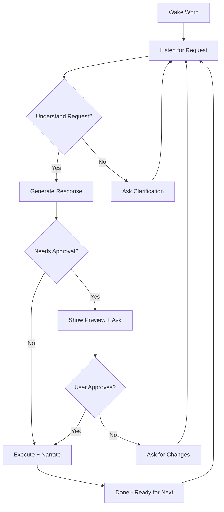

# OSE CAD Voice AI - "BuildBot"
>
> **Voice-controlled CAD for Everyone: Kids, Seniors, and Dreamers**
> *"Build anything with just your imagination and voice"*

---

## 🎯 Vision

Create an **open-source, community-owned AI model** specifically trained for CAD automation that:

- Kids can use with their **voice and imagination**
- Seniors can use **without learning complex software**
- Everyone **owns together** (no corporate lock-in)

---

## 👶 User Personas

### 1. Kids (Ages 8-14) - "Young Builders"

**Interaction**: Voice + Simple drawings

```
Kid: "BuildBot, make me a treehouse with a rope ladder!"
BuildBot: "Awesome! Let's build your treehouse together! 
          Should it be big enough for 2 friends or 4 friends?"
Kid: "4 friends!"
BuildBot: "Perfect! I'm creating a 6-foot by 6-foot platform...
          [Shows 3D preview] Does this look cool?"
```

### 2. Seniors (65+) - "Experienced Dreamers"

**Interaction**: Voice + Simple approval

```
Senior: "I want to build a raised garden bed for tomatoes."
BuildBot: "Great choice! Standard size is 4 feet by 8 feet, 
          18 inches high. That's comfortable for reaching without bending.
          Want me to create the plans?"
Senior: "Yes, but make it 24 inches high for my back."
BuildBot: "Done! Here's your materials list and step-by-step instructions.
          Would you like me to read them out loud?"
```

### 3. Makers (All ages) - "Tinkerers"

**Interaction**: Voice + Detailed requests

```
Maker: "BuildBot, modify the SH7 floor module to use 2x10 joists instead of 2x8"
BuildBot: "Understood. Changing joists from 2x8 to 2x10:
          - Increases max span from 12'4\" to 16'1\"
          - Adds $45 to material cost
          - Floor depth increases by 2 inches
          Should I apply this change?"
```

---

## 🏗️ System Architecture

```
┌─────────────────────────────────────────────────────────────────┐
│                        USER INTERFACE                           │
│  ┌─────────────┐  ┌─────────────┐  ┌─────────────────────────┐  │
│  │   Voice     │  │   Touch/    │  │   Text Chat             │  │
│  │   (Whisper) │  │   Draw      │  │   (Keyboard)            │  │
│  └──────┬──────┘  └──────┬──────┘  └───────────┬─────────────┘  │
└─────────┼────────────────┼─────────────────────┼────────────────┘
          │                │                     │
          ▼                ▼                     ▼
┌─────────────────────────────────────────────────────────────────┐
│                    BUILDBOT AI CORE                             │
│  ┌─────────────────────────────────────────────────────────────┐│
│  │  Fine-tuned Ollama Model (Local, Privacy-First)             ││
│  │  Base: DeepSeek-R1 / Llama 3.2 / Mistral                    ││
│  │  Training: OSE CAD corpus + Construction knowledge          ││
│  └─────────────────────────────────────────────────────────────┘│
│                              │                                  │
│  ┌──────────────┐ ┌──────────┴──────────┐ ┌───────────────────┐│
│  │ Intent Parser│ │ CAD Knowledge Base  │ │ Safety Validator  ││
│  │ (What to do) │ │ (50 GVCS + IRC/IBC) │ │ (Structural OK?)  ││
│  └──────────────┘ └─────────────────────┘ └───────────────────┘│
└─────────────────────────────────────────────────────────────────┘
                              │
                              ▼
┌─────────────────────────────────────────────────────────────────┐
│                    CAD AUTOMATION LAYER                         │
│  ┌────────────────┐ ┌────────────────┐ ┌──────────────────────┐ │
│  │ FreeCAD Bridge │ │ Weaver v2.0   │ │ Validator            │ │
│  │ (Generate CAD) │ │ (Instructions)│ │ (Code Compliance)    │ │
│  └────────────────┘ └────────────────┘ └──────────────────────┘ │
└─────────────────────────────────────────────────────────────────┘
                              │
                              ▼
┌─────────────────────────────────────────────────────────────────┐
│                        OUTPUT                                   │
│  ┌────────────┐ ┌─────────────┐ ┌───────────┐ ┌──────────────┐  │
│  │ 3D Preview │ │ Build Guide │ │ Cut List  │ │ Voice Readout│  │
│  │ (WebGL)    │ │ (Markdown)  │ │ (PDF)     │ │ (TTS)        │  │
│  └────────────┘ └─────────────┘ └───────────┘ └──────────────┘  │
└─────────────────────────────────────────────────────────────────┘
```

---

## 🤖 Model Training Strategy

### Phase 1: Base Model Selection (Week 1)

| Model | Size | Advantage | License |
|-------|------|-----------|---------|
| **DeepSeek-R1** | 1.5B-70B | Reasoning, local | MIT |
| Llama 3.2 | 3B-90B | Multimodal | Meta |
| Mistral | 7B | Fast, efficient | Apache 2.0 |

**Recommendation**: Start with **DeepSeek-R1:7B** (fits on Apple Silicon, great reasoning)

### Phase 2: Training Data Collection (Week 2-3)

```
training_data/
├── cad_json/              # All extracted CAD files (50+ models)
│   ├── hangar.json
│   ├── sh7_floor_*.json
│   └── ...
│
├── instructions/          # Platinum instructions (50+ files)
│   ├── Hangar_Instructions.md
│   ├── SH7_Floor_Module_5_Instructions.md
│   └── ...
│
├── dialogues/             # Synthetic conversation examples
│   ├── kid_treehouse.jsonl
│   ├── senior_garden_bed.jsonl
│   └── maker_modifications.jsonl
│
├── building_codes/        # IRC/IBC tables
│   ├── span_tables.json
│   ├── load_requirements.json
│   └── ...
│
└── ose_wiki/              # OSE Wiki articles
    ├── gvcs_machines.json
    ├── construction_techniques.json
    └── ...
```

### Phase 3: Fine-Tuning (Week 4)

```bash
# Using Ollama's create command with custom Modelfile
ollama create buildbot -f ./Modelfile
```

**Modelfile**:

```dockerfile
FROM deepseek-r1:7b

# System prompt for CAD assistance
SYSTEM """
You are BuildBot, a friendly AI assistant that helps people design and build 
real-world projects. You specialize in Open Source Ecology's Global Village 
Construction Set and can generate FreeCAD models, build instructions, and 
material lists.

Key behaviors:
- Use simple, encouraging language for kids
- Be patient and clear for seniors
- Provide technical details for makers when asked
- Always validate structural safety
- Suggest improvements when appropriate
- Ask clarifying questions instead of assuming
"""

# Add training data
ADAPTER ./buildbot_lora.gguf
```

---

## 🎤 Voice Interface Design

### Speech-to-Text (Local)

- **Whisper.cpp** - OpenAI's Whisper running locally
- **Wake word**: "Hey BuildBot" or "Builder"
- **Languages**: English first, then Spanish, French, German

### Text-to-Speech (Local)

- **Piper TTS** - Fast, natural-sounding, offline
- **Voices**: Child-friendly, Senior-friendly options
- **Speed control**: Adjustable for different users

### Conversation Flow



---

## 📱 Interface Options

### 1. Web App (Primary)

- Works on any device with a browser
- Voice via Web Speech API + Whisper fallback
- 3D preview with Three.js

### 2. Mobile App (Future)

- iOS/Android native
- Camera for AR preview
- Offline mode

### 3. Smart Display / Kiosk (Workshop)

- Raspberry Pi + touchscreen
- Rugged for workshop use
- Hands-free voice control

---

## 🔒 Privacy & Ownership

### Community Ownership Model

- **Open weights**: Model weights published on HuggingFace
- **Open training data**: All data in public repo
- **Open code**: Apache 2.0 / CERN-OHL-S
- **No telemetry**: Zero data collection
- **Local processing**: Runs entirely on user's hardware

### No Corporate Lock-In

```
❌ NO OpenAI API dependency
❌ NO Google Cloud required
❌ NO subscription fees
❌ NO usage tracking

✅ Runs on your own computer
✅ Runs offline
✅ You own the model
✅ Community improves it together
```

---

## 🚀 Implementation Roadmap

### Phase 1: Foundation (Weeks 1-2)

- [x] Weaver v2.0 (Platinum instructions)
- [ ] Process all 47 SH7 CAD files
- [ ] Create training dialogue examples
- [ ] Set up Ollama fine-tuning pipeline

### Phase 2: Voice Interface (Weeks 3-4)

- [ ] Integrate Whisper.cpp for STT
- [ ] Integrate Piper for TTS
- [ ] Create web-based voice UI
- [ ] Test with kids and seniors

### Phase 3: Model Training (Weeks 5-6)

- [ ] Fine-tune DeepSeek-R1:7B
- [ ] Evaluate on test dialogues
- [ ] Iterate on system prompt
- [ ] Publish to HuggingFace

### Phase 4: Community Launch (Week 7+)

- [ ] GitHub repo with full documentation
- [ ] OSE Wiki integration
- [ ] Community contribution guide
- [ ] Workshop demo video

---

## 💡 Example Conversations

### Kid Building a Birdhouse

```
Kid: "BuildBot, I want to make a birdhouse for my backyard!"

BuildBot: "A birdhouse! Awesome choice! 🐦
          What kind of birds do you want to attract?
          - Small birds like chickadees (small hole)
          - Medium birds like bluebirds (bigger hole)
          - Big birds like owls (really big house!)"

Kid: "Bluebirds!"

BuildBot: "Great! Bluebirds like an entrance hole that's 1.5 inches wide.
          I'll make you a perfect bluebird house!
          [Shows 3D model spinning]
          Here it is! It uses one 6-foot fence board.
          Should I show you how to build it?"

Kid: "Yes!"

BuildBot: "Step 1: Get a grown-up to help with cutting.
          Step 2: Cut the board into these 6 pieces...
          [Shows animated assembly]"
```

### Senior Building Raised Beds

```
Senior: "I need garden beds I can reach without bending."

BuildBot: "I can help with that! For comfortable gardening without bending,
          I recommend 30-inch high raised beds.
          
          A 4-foot by 8-foot bed at that height would need:
          - 10 pieces of 2x12 cedar (8 feet long)
          - About 2 cubic yards of soil
          - Total cost: around $180 for wood
          
          Would you like me to create the plans?"

Senior: "Yes, but make it 4 by 4, my garden is small."

BuildBot: "Perfect! A 4-foot by 4-foot bed is easier to reach from all sides.
          Updating the plans now...
          [Shows updated model]
          
          New materials:
          - 6 pieces of 2x12 cedar (4 feet long)
          - About 1/2 cubic yard of soil
          - Total cost: around $65 for wood
          
          Want me to read the building steps out loud?"
```

---

## 📊 Success Metrics

| Metric | Target | Measurement |
|--------|--------|-------------|
| Voice accuracy | 95%+ | Speech recognition accuracy |
| Kid satisfaction | 4.5/5 | Post-build survey |
| Senior usability | 4.5/5 | Can complete without help |
| Build success rate | 90%+ | Projects completed successfully |
| Community contributors | 50+ | GitHub contributors |
| Model downloads | 1000+ | HuggingFace downloads |

---

## 🤝 How You Can Help

1. **Test with real users** - Kids, grandparents, yourself!
2. **Contribute training data** - More conversation examples
3. **Process more CAD files** - Run batch_process.py on GVCS models
4. **Improve the model** - Fine-tune and share improvements
5. **Build and share** - Show off what you built with BuildBot!

---

> *"The best CAD software is the one you don't have to learn."*
> — BuildBot Philosophy
